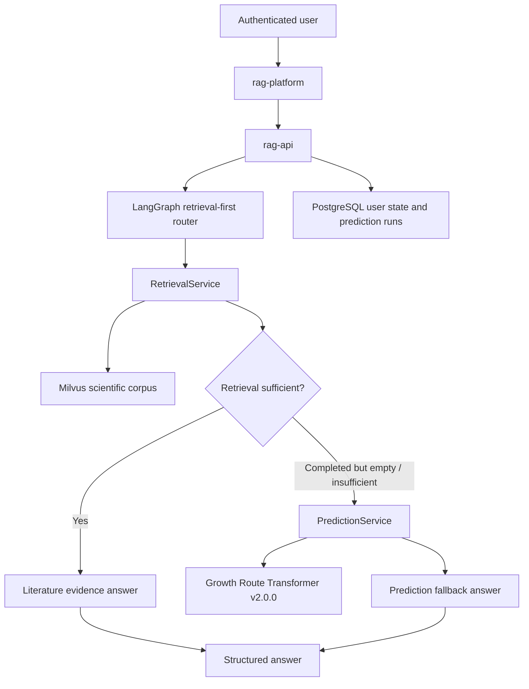

# Unified Research RAG Platform Design

## Purpose

AgentWeb is a single research workbench for single-crystal growth. Conversation, direct
evidence search, and formula-conditioned route generation are different ways to use the
same authenticated product, not separate web platforms.

## Web Account Contract

The Web product uses one normalized email address as the account identifier and a password as
the authenticator. It deliberately does **not** verify ownership of the supplied email address:
the first successful login with an unregistered email and a valid password creates the account;
an existing email must pass password verification. Passwords use Argon2id hashes. Login sessions
are opaque server-side records represented in the browser by HttpOnly cookies.

`user_id` is derived exclusively from that authenticated server-side session. The public browser
API never accepts `user_id` as a trusted request field. The development CLI remains the sole
local testing surface allowed to provide explicit `--user-id` values.



## Product Workspaces

The web application has three workspaces under one login and one navigation model.

| Workspace | Primary use | API capability |
| --- | --- | --- |
| Chat | Ask a research question; use real records first and model fallback only when eligible | `/api/rag/chat/stream` |
| Evidence | Inspect and filter source records directly | `/api/rag/retrieve` |
| Predict | Explicitly submit a formula and inspect model route candidates | `/api/rag/predict` |

No workspace has direct database, Milvus, or model-runtime access.

## Evidence Contract

Every research answer is built from typed evidence. Ranking happens only within an evidence
kind; literature scores and model beam scores are never numerically merged. More importantly,
a single Chat answer selects exactly one evidence kind. It does not contain a combined pack of
literature evidence and model predictions.

```text
LiteratureEvidence
  kind = literature_record
  record_id, doi, source_text, matched_fields, retrieval_score

PredictionEvidence
  kind = model_prediction
  prediction_run_id, model_id, model_version, formula,
  routes, warnings, artifact_digest
```

`LiteratureEvidence` is selected when retrieval is sufficient. It may produce citations.
`PredictionEvidence` is selected only for an explicit Predict request or a valid Chat fallback
after retrieval completed as `empty` or `insufficient`. It is a candidate for experimental
validation, not a citation.

The fallback decision is separately represented as:

```text
RetrievalOutcome
  status = sufficient | empty | insufficient | invalid_request | unavailable
  reason_codes
  requested_slots
  covered_slots
  usable_record_ids
  fallback_allowed
```

`unavailable` means the retrieval infrastructure failed. It is never evidence that the corpus
is empty and must not trigger a model fallback. Weak retrieval candidates remain diagnostics;
they are not inserted into the prediction-answer context or rendered as model support.

## Growth Route Transformer v2.0.0

The vendored model bundle is located at:

```text
services/rag-api/models/growth-route-transformer/v2.0.0/
```

It is a 6,614,099-parameter Transformer encoder-decoder. It takes a chemical formula,
uses constrained beam search, and returns up to three `Flux` or `CVT` route candidates.
The checkpoint is approximately 25 MiB before Python runtime overhead.

The deployed model contract is:

```text
Input:
  formula: string

Output:
  normalized formula
  target elements
  unknown formula tokens
  up to three ranked route candidates
  method, raw reactants, additives
  temperature-bin ranges and duration-bin range
  model version and validation warnings
```

The v2.0.0 model has no input channel for a user's furnace, pressure, atmosphere, or
method constraint. The RAG workflow may screen its generated routes against those
constraints, but cannot claim they were part of the model prediction.

Reported held-out-formula validation metrics are recorded in the model card. The model is
used for route candidate generation, not for a deterministic experimental prescription.

## Capability Routing

The Chat graph uses an ordered retrieval-first path, not a parallel fusion path:

```text
direct_answer
retrieval_first
literature_answer
prediction_fallback
clarify
retrieval_unavailable
```

`explicit_prediction` is reserved for the Predict workspace and `POST /api/rag/predict`; it
is a user-requested model execution and not a Chat retrieval fallback.

| User request | Resulting path |
| --- | --- |
| "ZnIn2S4 的 CVT 温度有哪些文献记录？" with sufficient records | `literature_answer` |
| "ZnIn2S4 的 CVT 温度有哪些文献记录？" with no usable records | bounded no-evidence answer; do not present a model route as a literature fact |
| "没有找到 Mn3GaN 的记录，请给我可尝试的生长方案" | `prediction_fallback`, after valid formula resolution |
| "Mn3GaN 怎么做？" or "如何制备 Mn3GaN？" with no usable records | `prediction_fallback`, with output labeled as unverified model candidates |
| "为 Mn3GaN 生成三条候选生长路线" in Predict | `explicit_prediction` |
| "为我推荐生长方案" with no formula | `clarify` |

For ordinary route-recommendation requests, `retrieval_first` plans and runs retrieval, then
assesses record identity, material/method match, requested-field coverage, and source
integrity. A non-empty result list or a high retrieval score alone cannot select literature
evidence. Only a completed `empty` or `insufficient` assessment can enter
`prediction_fallback`; the graph validates the formula before loading the model.

## Prediction Persistence

Each model execution produces a `prediction_run` owned by the authenticated user. It stores
the model identity, version, input, output, validation warnings, artifact digest, and timing.
The run can be revisited in the Predict workspace and referenced by an answer.

Prediction runs do not become long-term memory automatically. A user-confirmed preference,
constraint, or compact research conclusion may be written through the existing controlled
memory policy.

## Model Bundle Lifecycle

Model source and runtime assets are versioned together in the RAG repository. Training data
and raw experimental data stay outside the deployment bundle. The runtime verifies the
manifest digest before loading a model.

Replacing a model requires a new version directory and a new manifest. Existing prediction
runs continue to reference their original `model_id`, `model_version`, and artifact digest.

## Deployment

The ThinkPad hosts the API, model runtime, PostgreSQL, Milvus, and workers. The public 1 GiB
gateway hosts only HTTPS/static delivery/reverse proxy/tunnel functionality. Prediction model
assets and Python scientific dependencies never belong on the public gateway.
